# EPUB 转有声书转换器 — 项目结构与运行流程总结

## 1. 项目概述

本项目是 [p0n1/epub_to_audiobook](https://github.com/p0n1/epub_to_audiobook) 的深度定制分支，专为中国用户工作流优化。支持将 **EPUB / DOC / DOCX** 格式的电子书转换为分章节的有声书音频文件，并提供丰富的 **TTS（文本转语音）引擎** 选择。

### 核心特性

- **6 种 TTS 引擎**：Qwen（通义千问）、MiMo（小米）、Edge（微软免费）、MiniMax、Piper（本地）、Chatterbox（本地离线）
- **Apple 风格 WebUI**：单页工作台，毛玻璃 + 胶囊导航（`main_ui.py`）
- **CLI 命令行**：适合批量/脚本化处理
- **分章节并行转换**：通过 `multiprocessing.Pool` 实现
- **智能文本分块**：基于 `sentencex` 的句子感知分块
- **ID3 元数据**：每章节音频自动嵌入标题、作者、书名、章节号
- **中文友好**：UI 字符串、注释均为中文；支持中文分句和字符计数

---

## 2. 项目结构

```
├── main.py                          # CLI 入口（自动检测 Chatterbox 虚拟环境）
├── main_ui.py                       # Apple 风格 WebUI 入口（端口 7862）
├── entrypoint.sh                    # Docker 容器入口脚本
├── requirements.txt                 # 依赖清单
├── mimo_config.json.example         # MiMo 配置模板
├── .webui_settings.json             # WebUI 复选框持久化
│
├── audiobook_generator/             # 核心库
│   ├── config/
│   │   ├── general_config.py        # 所有 CLI/UI 参数的统一配置类
│   │   └── ui_config.py             # UI 专用配置（host + port）
│   │
│   ├── book_parsers/                # 电子书解析器
│   │   ├── base_book_parser.py      # 抽象基类 + 工厂方法 get_book_parser()
│   │   ├── epub_book_parser.py      # EPUB 解析（ebooklib + BeautifulSoup）
│   │   └── doc_book_parser.py       # DOC/DOCX 解析（python-docx / textutil）
│   │
│   ├── core/
│   │   ├── audiobook_generator.py   # 核心引擎：编排整个转换流程
│   │   └── audio_tags.py            # ID3 标签数据类
│   │
│   ├── tts_providers/               # TTS 引擎实现
│   │   ├── base_tts_provider.py     # 抽象基类 + 工厂 get_tts_provider()
│   │   ├── qwen_tts_provider.py     # 通义千问 TTS（REST API）
│   │   ├── openai_tts_provider.py   # MiMo 小米 TTS（Chat Completions API）
│   │   ├── edge_tts_provider.py     # 微软 Edge TTS（免费，无需 Key）
│   │   ├── minimax_tts_provider.py  # MiniMax TTS（WebSocket API）
│   │   ├── piper_tts_provider.py    # Piper TTS（Docker 或本地 CLI）
│   │   └── chatterbox_tts_provider.py # Chatterbox 本地离线 TTS
│   │
│   ├── ui/
│   │   └── web_ui.py                # Apple 风格 WebUI（胶囊导航 + 弹窗）
│   │
│   └── utils/
│       ├── utils.py                 # 文本分块、音频合并、ID3 标签写入
│       ├── log_handler.py           # 日志配置（文件 + 控制台）
│       ├── filename_sanitizer.py    # 跨平台安全文件名生成
│       ├── mimo_config.py           # MiMo 凭证管理
│       ├── minimax_config.py        # MiniMax 凭证管理
│       ├── qwen_config.py           # Qwen 凭证管理
│       └── docker_helper.py         # Piper Docker 容器管理
│
├── venv_chatterbox/                 # Chatterbox 独立虚拟环境
│   ├── run_with_chatterbox.sh       # Chatterbox CLI 启动脚本
│   └── run_ui_chatterbox.sh         # Chatterbox UI 启动脚本
│
└── tests/                           # unittest 测试
    ├── args_test.py                 # 参数解析测试
    ├── split_test.py                # 文本分块测试
    └── tts_providers/               # TTS 提供商单元测试
```

---

## 3. 运行流程详解

### 3.1 整体流程图

```mermaid
flowchart TB
    subgraph 输入层["📥 输入层"]
        CLI["CLI: python3 main.py"]
        UI["WebUI: main_ui.py"]
        CHAT_SCRIPT["Chatterbox 脚本\nrun_with_chatterbox.sh"]
    end

    subgraph 自动跳转["🔄 自动环境跳转"]
        VENV_CHECK{"检测到\nvenv_chatterbox/?"}
        RE_EXEC["os.execv() 切换到\nvenv Python 解释器"]
        SET_ENV["设置 HF_HOME / NUMBA_CACHE_DIR\n等缓存环境变量"]
    end

    subgraph 配置层["⚙️ 配置解析"]
        ARGS["argparse 解析参数"]
        CONFIG["GeneralConfig\n统一配置对象"]
        UI_CONFIG["UiConfig\nhost + port"]
    end

    subgraph 解析层["📖 电子书解析"]
        PARSER_FACTORY["get_book_parser()\n根据扩展名选择解析器"]
        EPUB_PARSER["EpubBookParser\nebooklib + BeautifulSoup\n逐 HTML 文档解析"]
        DOC_PARSER["DocBookParser\npython-docx / textutil\n整文档作为单章"]
        TEXT_CLEAN["文本清洗\nnewline_mode / 尾注去除\n引用编号去除 / 搜索替换"]
        TITLE_PARSE["标题提取\nauto/tag_text/first_few"]
    end

    subgraph 分章["📑 章节处理"]
        CHAPTERS["获取章节列表"]
        FILTER["过滤空/过短章节"]
        SELECT["按 chapter_start/end\n选择子集"]
        COST_EST["预估字符数和费用"]
        CONFIRM{"确认继续？"}
    end

    subgraph 并行转换["⚡ 并行转换 (multiprocessing.Pool)"]
        POOL["multiprocessing.Pool\nworker_count 个进程"]
        TEXT_SPLIT["split_text()\n按句子智能分块\nmax_chars 控制每块大小"]
        TTS["text_to_speech()\n调用对应 TTS 引擎"]
        SAVE_TEXT["可选: 保存 .txt 原文"]
        MERGE["合并音频段"]
        TAGS["写入 ID3 元数据\n(标题/作者/书名/章节)"]
    end

    subgraph 输出层["📂 输出层"]
        AUDIO["每个章节一个音频文件\n(格式取决于 TTS 引擎)"]
        LOG["日志文件\nlogs/EtA_*.log"]
    end

    subgraph TTS引擎["🎙️ TTS 引擎选择"]
        QWEN["QwenTTS\nREST API → MP3\n通义千问 TTS"]
        MIMO["OpenAITTS(MiMo)\nChat Completions + audio\n小米 TTS"]
        EDGE["EdgeTTS\nedge-tts 库\n微软免费 TTS"]
        MINIMAX["MiniMaxTTS\nWebSocket API\nMiniMax TTS"]
        PIPER["PiperTTS\nDocker 或本地 CLI\n离线 TTS"]
        CHATTERBOX["ChatterboxTTS\nPyTorch 本地推理\n支持语音克隆"]
    end

    CLI --> VENV_CHECK
    UI --> UI_CONFIG
    CHAT_SCRIPT --> VENV_CHECK
    
    VENV_CHECK -->|存在| SET_ENV
    VENV_CHECK -->|不存在| ARGS
    SET_ENV --> RE_EXEC
    RE_EXEC --> ARGS
    
    UI_CONFIG --> CONFIG
    ARGS --> CONFIG
    CONFIG --> PARSER_FACTORY
    
    PARSER_FACTORY -->|.epub| EPUB_PARSER
    PARSER_FACTORY -->|.doc/.docx| DOC_PARSER
    
    EPUB_PARSER --> TEXT_CLEAN
    DOC_PARSER --> TEXT_CLEAN
    TEXT_CLEAN --> TITLE_PARSE
    
    TITLE_PARSE --> CHAPTERS
    CHAPTERS --> FILTER
    FILTER --> SELECT
    SELECT --> COST_EST
    COST_EST --> CONFIRM
    CONFIRM -->|y| POOL
    CONFIRM -->|n| EXIT(["退出"])
    
    POOL --> TTS
    POOL --> SAVE_TEXT
    
    SAVE_TEXT --> TEXT_SPLIT
    TEXT_SPLIT --> TTS
    TTS --> MERGE
    MERGE --> TAGS
    
    TAGS --> AUDIO
    TAGS --> LOG

    CONFIG -->|--tts 参数| TTS引擎
    TTS引擎 --> TTS
```



### 3.2 各阶段详细说明

#### 阶段 1：环境检测与切换

`main.py` 和 `main_ui.py` 顶部有一段自动检测逻辑：

```python
# 检测项目根目录下是否存在 venv_chatterbox/
# 若存在且当前 Python 不是 venv 中的解释器，则：
# 1. 设置 NUMBA_CACHE_DIR / HF_HOME 等缓存目录
# 2. 通过 os.execv() 切换到 venv_chatterbox/bin/python3 重新执行
```

这意味着对于 Chatterbox TTS，用户只需一条命令即可，无需手动激活虚拟环境。

#### 阶段 2：配置解析

- **CLI 模式**：`main.py:handle_args()` 使用 `argparse` 解析完整参数集，返回 `GeneralConfig` 对象
- **WebUI 模式**：`main_ui.py` 解析 `--host` 和 `--port`，然后通过 Gradio 表单收集用户输入，动态构造 `GeneralConfig`
- `GeneralConfig` 包含**所有** TTS 提供商和解析器的参数，未使用的字段保持 `None`

#### 阶段 3：电子书解析

**工厂模式**：`get_book_parser(config)` 根据输入文件扩展名返回对应解析器

| 解析器 | 支持格式 | 依赖库 | 章节策略 |
|--------|---------|--------|---------|
| `EpubBookParser` | `.epub` | ebooklib, BeautifulSoup | 按 HTML 文档逐章拆分 |
| `DocBookParser` | `.doc`, `.docx` | python-docx, textutil, antiword | 整文档作为一章 |

**EpubBookParser 文本清洗流程**：
1. 提取原始文本 → 2. 按 `newline_mode` 替换换行 → 3. 压缩多余空白 → 4. 可选：去除尾注编号 → 5. 可选：去除引用编号（`[1]`, `[2.3]`） → 6. 用户自定义搜索替换

**标题提取策略**（`title_mode`）：
- `auto`：优先搜索 `<title>/<h1>/<h2>/<h3>` 标签，若为空或纯数字则取前 60 字符
- `tag_text`：仅使用 HTML 标签标题
- `first_few`：直接取前 60 字符

#### 阶段 4：并行转换

`AudiobookGenerator.run()` 的核心逻辑：

1. **创建输出目录**：`os.makedirs(output_folder)`
2. **获取章节列表**（已过滤空章节）
3. **校验章节范围**：`chapter_start` / `chapter_end`
4. **费用预估**：`tts_provider.estimate_cost(total_chars)`
5. **用户确认**（可选，通过 `--no_prompt` 跳过）
6. **多进程处理**：
   - 使用 `multiprocessing.Pool(processes=worker_count)`
   - `initializer=setup_logging` 初始化子进程日志
   - `pool.imap_unordered()` 并行处理章节
   - 每章处理：分块 → TTS 调用 → 合并 → 写 ID3 标签

#### 阶段 5：TTS 引擎对比

| 引擎 | 类型 | 是否需要 API Key | 付费 | 中文支持 | 输出格式 | 特点 |
|------|------|-----------------|------|---------|---------|------|
| **Qwen**（默认） | 云端 REST API | ✅ QWEN_TTS_API_KEY | ❌ 免费 | ✅ 优秀 | MP3 | 通义千问 TTS，中文效果最佳 |
| **MiMo (OpenAI)** | 云端 Chat API | ✅ OPENAI_API_KEY | ✅ 按量 | ✅ 良好 | WAV/MP3/AAC/FLAC/OPUS | 小米 TTS，支持流式 |
| **Edge** | 云端 WebSocket | ❌ 无需 | ✅ 免费 | ✅ 良好 | MP3/OGG/WAV | 微软免费，音色极其丰富 |
| **MiniMax** | 云端 WebSocket | ✅ MINIMAX_API_KEY | ✅ 按量 | ✅ 出色 | MP3/WAV/FLAC/PCM | 音色选择极多（中文特色） |
| **Piper** | 本地/Docker | ❌ 无需 | ✅ 免费 | ⚠️ 有限 | WAV | 完全离线，多种语言模型 |
| **Chatterbox** | 本地 PyTorch | ❌ 无需 | ✅ 免费 | ✅ 优秀 | WAV/MP3/AAC/FLAC | 离线、支持语音克隆 |

**关键差异**——MiMo 提供商使用 `chat.completions.create`（非标准 TTS API），通过 `audio` 参数块传递：

```python
completion = self.client.chat.completions.create(
    model="mimo-v2.5-tts",
    messages=[
        {"role": "user", "content": "朗读指令"},
        {"role": "assistant", "content": "要朗读的文本"}
    ],
    audio={"format": "wav", "voice": "mimo_default"}
)
```

#### 阶段 6：音频后处理

1. **文本分块**（`split_text()`）：基于 `sentencex` 库按句子感知分块，支持中文标点
2. **音频合并**：支持两种模式
   - `use_pydub_merge=True`：保存临时文件，pydub 合并后删除
   - `use_pydub_merge=False`：直接二进制拼接（更快）
3. **ID3 标签**：`mutagen` 库写入 TIT2（标题）、TPE1（作者）、TALB（书名）、TRCK（章节号）
4. **文件名生成**（`make_safe_filename()`）：`{章节号:04d}_{清洗后标题}.{扩展名}`，跨平台安全，自动截断

---

## 4. 两种入口模式对比

| 特性 | CLI (main.py) | Apple 风格 WebUI (main_ui.py) |
|------|-------------|------------------------------|
| **端口** | — | 7862 |
| **启动方式** | `python3 main.py input.epub output_dir` | `python3 main_ui.py` |
| **UI 风格** | 无 | 胶囊导航 + 二级页面 + 弹窗 |
| **TTS 配置** | 命令行参数 | 卡片选择 + 浮层弹窗 |
| **密码保护** | 无 | ✅ 管理员密码 |
| **资源库** | 无 | ✅ 文件列表 + 打包下载 |
| **API 配置 UI** | 环境变量/配置文件 | ✅ 内置 MiMo/Qwen/MiniMax 配置面板 |
| **Chatterbox 检测** | ✅ 自动切换 venv | ✅ 自动切换 venv |

---

## 5. 凭证配置体系

各 TTS 引擎的凭证遵循统一的优先级：**WebUI 保存的本地配置文件 > 环境变量 > 交互式输入（仅 CLI）**

| 引擎 | 配置文件（项目根目录） | 环境变量 |
|------|----------------------|---------|
| MiMo | `mimo_config.json` | `OPENAI_API_KEY`, `OPENAI_BASE_URL` |
| MiniMax | `minimax_config.json` | `MINIMAX_API_KEY` |
| Qwen | `qwen_config.json` | `QWEN_TTS_API_KEY`, `QWEN_TTS_BASE_URL`, `QWEN_TTS_MODEL` |

在 Apple 风格 WebUI 中，这些配置可在「设置」页面内直接编辑和测试连接。

---

## 6. 关键设计决策

1. **ffmpeg 路径硬编码**：`main.py:13-14` 将 `AudioSegment.converter` 硬编码为 `/opt/homebrew/bin/ffmpeg`，仅 macOS 可用。Linux/Docker 部署需修改。

2. **Chatterbox 独立 venv**：由于 `chatterbox-tts 0.1.7` 强制依赖 `gradio==6.8.0`（与项目的 `gradio==5.50.0` 冲突），Chatterbox 只能在独立的虚拟环境中运行。

3. **消息级 TTS 调用**：MiMo 提供商不走标准的 `audio/speech` API，而是使用 `chat.completions` 在消息级传递音频块，这是一个非标准的设计。

4. **中文注释与 UI**：新增代码的注释和 UI 文本均为中文，保持与原仓库的英文文档和注释的区分。

5. **Docker 支持**：`entrypoint.sh` 根据参数自动判断运行 CLI 还是 WebUI，Docker 构建在 Git tag 推送时触发。

---

## 7. 测试

- 框架：`unittest`（无 pytest 配置）
- 运行方式：`python3 -m pytest tests` 或 `python3 -m unittest discover tests`
- 测试文件：
  - `tests/args_test.py` — CLI 参数解析测试
  - `tests/split_test.py` — 文本分块测试
  - `tests/audiobook_generator/tts_providers/*_test.py` — 各 TTS 提供商测试
  - `tests/audiobook_generator/book_parsers/epub_book_parser_test.py` — EPUB 解析测试

---

## 8. 目录与文件约定

| 路径 | 用途 |
|------|------|
| `audiobook_output/` | 默认输出目录（WebUI 自动生成） |
| `logs/` | 日志文件（`EtA_*.log`, `EtA_WebUI_*.log`） |
| `.webui_settings.json` | WebUI 开关状态持久化 |
| `mimo_config.json` | MiMo API 配置（gitignored） |
| `minimax_config.json` | MiniMax API 配置（gitignored） |
| `qwen_config.json` | Qwen API 配置（gitignored） |
| `venv_chatterbox/` | Chatterbox 虚拟环境 + 模型缓存（~3.1GB） |

---

*文档生成日期：2026-09-10*
*基于代码库深度分析生成*
