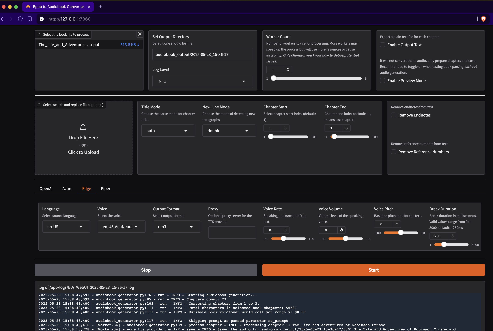

# EPUB to Audiobook Converter [](https://discord.com/invite/pgp2G8zhS7) [](https://deepwiki.com/p0n1/epub_to_audiobook)

本项目为 `p0n1/epub_to_audiobook` 的中文定制分支，采用 **Apple 风格 Gradio WebUI**（入口 `main_ui.py`），支持 MiMo / MiniMax / Edge / Chatterbox 等语音引擎。

```bash
git clone https://github.com/Yinbob/EPUB_to_Audio_Converter.git
cd EPUB_to_Audio_Converter
python3 -m venv venv
source venv/bin/activate
pip install -r requirements.txt

# 启动 Apple 风格 WebUI（默认 http://127.0.0.1:7862）
python3 main_ui.py

# 对外/后台运行
nohup python3 main_ui.py --host 0.0.0.0 --port 7862 > logs/webui.out 2>&1 &

# CLI 转换
python3 main.py <input_file> <output_folder> [options]
```

> 服务器（Miniconda / GPU）部署见 [Linux 服务器部署（Miniconda）](#linux-服务器部署miniconda)。


## Recent Updates

- 2025-05-23: Added a web interface (WebUI) to the project.

## Audio Sample

If you're interested in hearing a sample of the audiobook generated by this tool, check the links bellow. 

- [Azure TTS Sample](https://audio.com/paudi/audio/0008-chapter-vii-agricultural-experience)
- [OpenAI TTS Sample](https://audio.com/paudi/audio/openai-0008-chapter-vii-agricultural-experience-i-had-now-been-in)
- Edge TTS Sample: the voice is almost the same as Azure TTS
- [Piper TTS](https://rhasspy.github.io/piper-samples/)
- [Kokoro TTS](https://huggingface.co/spaces/hexgrad/Kokoro-TTS) (usage of this is done through a local OpenAI endpoint)

## Requirements

- Python 3.10+ Or ***Docker***
- For using *Azure TTS*, A Microsoft Azure account with access to the [Microsoft Cognitive Services Speech Services](https://portal.azure.com/#create/Microsoft.CognitiveServicesSpeechServices) is required.
- For using *OpenAI TTS*, OpenAI [API Key](https://platform.openai.com/api-keys) is required.
  - If you are using Kokoro TTS, you won't need an official OpenAI key, but you will need to put a dummy value in the env for it. (e.g. `export OPENAI_API_KEY='fake'`) unless you are using the docker compose file (see below)
- For using *Edge TTS*, no API Key is required.
- Piper TTS executable and models for *Piper TTS*

## Audiobookshelf Integration

The audiobooks generated by this project are optimized for use with [Audiobookshelf](https://github.com/advplyr/audiobookshelf). Each chapter in the EPUB file is converted into a separate MP3 file, with the chapter title extracted and included as metadata.


### Chapter Titles

Parsing and extracting chapter titles from EPUB files can be challenging, as the format and structure may vary significantly between different ebooks. The script employs a simple but effective method for extracting chapter titles, which works for most EPUB files. The method involves parsing the EPUB file and looking for the `title` tag in the HTML content of each chapter. If the title tag is not present, a fallback title is generated using the first few words of the chapter text.

Please note that this approach may not work perfectly for all EPUB files, especially those with complex or unusual formatting. However, in most cases, it provides a reliable way to extract chapter titles for use in Audiobookshelf.

When you import the generated MP3 files into Audiobookshelf, the chapter titles will be displayed, making it easy to navigate between chapters and enhancing your listening experience.

## Installation

1. Clone this repository:

    ```bash
    git clone https://github.com/p0n1/epub_to_audiobook.git
    cd epub_to_audiobook
    ```

2. Create a virtual environment and activate it:

    ```bash
    python3 -m venv venv
    source venv/bin/activate
    ```

3. Install the required dependencies:

    ```bash
    pip install -r requirements.txt
    ```

    Note: Python 3.14 requires the updated dependency set in this repository. Older installs pinned `gradio==5.33.1`, which could force a `pydantic-core` source build and fail with a PyO3 compatibility error during installation.

4. Set the following environment variables with your Azure Text-to-Speech API credentials, or your OpenAI API key if you're using OpenAI TTS:

    ```bash
    export MS_TTS_KEY=<your_subscription_key> # for Azure
    export MS_TTS_REGION=<your_region> # for Azure
    export OPENAI_API_KEY=<your_openai_api_key> # for OpenAI
    ```

## Linux 服务器部署（Miniconda）

> 本节适用于 **Ubuntu / Debian 服务器**（含 NVIDIA GPU）。macOS 本地开发仍可使用上面的 `python3 -m venv` 流程。

### 1️⃣ 系统依赖

```bash
sudo apt update
sudo apt install -y ffmpeg git build-essential
ffmpeg -version
```

> `ffmpeg` 用于音频合并/转码。项目会自动探测 `ffmpeg` / `ffprobe` 路径（也可用环境变量 `FFMPEG_PATH` / `FFPROBE_PATH` 手动覆盖），不再硬编码 macOS 路径。

### 2️⃣ 安装 Miniconda

```bash
wget https://repo.anaconda.com/miniconda/Miniconda3-latest-Linux-x86_64.sh -O /tmp/miniconda.sh
bash /tmp/miniconda.sh -b -p "$HOME/miniconda3"
"$HOME/miniconda3/bin/conda" init bash
source ~/.bashrc
```

### 3️⃣ 创建并激活主环境

```bash
conda create -n epub2audio python=3.11 -y
conda activate epub2audio
cd /path/to/EPUB_to_Audio_Converter
pip install -r requirements.txt
```

> - 保持 `gradio==5.50.0`，**不要**升级 gradio，否则前端排版会错乱。
> - `requirements.txt` 不包含 `torch`；若只使用 API 引擎（MiMo / MiniMax / Edge），此时即可正常启动（代码已把 torch 改为惰性导入）。

验证主环境可启动（无需 torch / Chatterbox）：

```bash
python3 -c "import gradio; print('gradio', gradio.__version__)"
python3 -c "from main import handle_args; print('main import ok')"
```

### 4️⃣ （可选）安装 Chatterbox 本地引擎（NVIDIA GPU）

Chatterbox 依赖 PyTorch（约 2~3 GB）与模型文件（约 3.1 GB）。项目约定将其隔离在 `venv_chatterbox/`，`main.py` / `main_ui.py` 会自动切换到该环境（无需手动 `activate`）。

```bash
conda activate epub2audio
python -m venv venv_chatterbox --system-site-packages

# 1) 安装 GPU 版 PyTorch（按驱动选择 cu121 / cu124）
./venv_chatterbox/bin/pip install torch==2.6.0 torchaudio==2.6.0 \
    --index-url https://download.pytorch.org/whl/cu124

# 2) 安装 chatterbox-tts
./venv_chatterbox/bin/pip install chatterbox-tts

# 3) chatterbox-tts 会强制安装 gradio 6.8.0，必须降回 5.50.0，避免前端兼容问题
./venv_chatterbox/bin/pip install --force-reinstall --no-deps gradio==5.50.0 gradio_client==1.14.0

# 4) 校验
./venv_chatterbox/bin/pip check
./venv_chatterbox/bin/python -c "import torch, gradio; print('cuda', torch.cuda.is_available(), 'gradio', gradio.__version__)"
```

> - 若 CUDA 驱动不支持 `cu124`，改用 `cu121`；无 GPU 时去掉 `--index-url` 安装 CPU 版。
> - `--system-site-packages` 让 `venv_chatterbox` 继承主环境的 Gradio 5.50.0 等依赖，避免重复安装。
> - 模型缓存自动下载到 `venv_chatterbox/.cache/huggingface/`；彻底删除：`rm -rf venv_chatterbox/`。
> - 已知问题：`perth` 缺少 `perth_net` 依赖，已在 `chatterbox/tts.py` 中回退到 `DummyWatermarker`，不影响使用。
> - 若需要 **VoxCPM 本地引擎**（推荐，效果更好、支持中文多音色），在同一虚拟环境中追加安装 `voxcpm`，见下文 [VoxCPM TTS（本地多模态语音引擎）](#voxcpm-tts本地多模态语音引擎)。

### 5️⃣ 配置凭证

```bash
# 方式一：环境变量
export OPENAI_API_KEY=<MiMo API Key>          # MiMo TTS 使用 openai 接口
export OPENAI_BASE_URL=https://token-plan-cn.xiaomimimo.com/v1
export MINIMAX_API_KEY=<MiniMax Key>          # 使用 MiniMax 时
export MS_TTS_KEY=<Azure Key>                 # 使用 Azure 时
export MS_TTS_REGION=<Azure Region>

# 方式二：本地配置文件（WebUI 也可保存）
cp mimo_config.json.example mimo_config.json
```

> WebUI 会把 MiMo / MiniMax 配置写入项目根目录的 `mimo_config.json` / `minimax_config.json`（已在 `.gitignore` 中，**请勿提交**）。

### 6️⃣ 启动（nohup 后台，端口 7862）

```bash
cd /path/to/EPUB_to_Audio_Converter
mkdir -p logs
nohup python3 main_ui.py --host 0.0.0.0 --port 7862 > logs/webui.out 2>&1 &
echo $! > logs/webui.pid
```

或使用仓库自带脚本（默认监听 `0.0.0.0:7862`）：

```bash
./run_ui.sh
# 停止： kill $(cat logs/webui.pid)
```

启动后访问 `http://<服务器IP>:7862`。若存在 `venv_chatterbox/`，启动时会自动切换到该环境，可直接使用 GPU 版 Chatterbox。

### 7️⃣ 部署后自检

```bash
# 进程与端口
curl -sI http://127.0.0.1:7862 | head -1        # 期望 HTTP/1.1 200
ss -ltnp | grep 7862

# 环境版本
python3 -c "import gradio; print('gradio', gradio.__version__)"                        # 5.50.0
./venv_chatterbox/bin/python -c "import torch; print('cuda', torch.cuda.is_available())"  # True

# 冒烟测试：用 Edge（免 Key）跑一章
python3 main.py examples/your-book.epub /tmp/out --tts edge --chapter_start 1 --chapter_end 1
```

### 8️⃣ 安全提示

WebUI **没有任何鉴权机制**，直接暴露到公网会让任何人都能调用你的 TTS 额度。生产环境建议：

- 仅监听内网，或用 SSH 隧道访问：`ssh -L 7862:127.0.0.1:7862 user@server`
- 前置 Nginx / Caddy 反向代理，开启 Basic Auth + HTTPS
- 反向代理时需为 Gradio 配置 `root_path`

## Web Interface (WebUI)

For users who prefer a graphical interface, this project includes a web-based UI built with Gradio. The WebUI provides an intuitive way to configure all the options and convert your EPUB files without using the command line.



### Environment Variables for WebUI

The WebUI respects the same environment variables as the command-line tool:

```bash
export MS_TTS_KEY=<your_subscription_key>      # For Azure TTS
export MS_TTS_REGION=<your_region>             # For Azure TTS
export OPENAI_API_KEY=<your_openai_api_key>    # For OpenAI TTS
export OPENAI_BASE_URL=<custom_endpoint>       # Optional: For custom OpenAI-compatible endpoints
```

Make sure to set the environment variables for the service you are using before starting the WebUI.

### Starting the WebUI

Make sure you have followed the [Installation](#installation) steps before starting the WebUI.

To launch the web interface, run:

```bash
python3 main_ui.py
```

By default, the WebUI will be available at `http://127.0.0.1:7862`. You can customize the host and port:

```bash
python3 main_ui.py --host 127.0.0.1 --port 8080
```

Remember to press `Ctrl+C` in the terminal to stop the server if you want to stop it after you are done.

### WebUI Features

The web interface provides:

- **File Upload**: Drag and drop your EPUB file directly into the browser
- **TTS Provider Selection**: Easy switching between Azure, OpenAI, Edge, and Piper TTS with provider-specific options
- **Voice Configuration**: Dropdown menus for selecting languages, voices, and output formats
- **Advanced Settings**: All command-line options are available through the web interface
- **Real-time Logs**: View conversion progress and logs directly in the browser
- **Preview Mode**: Test your settings without generating audio
- **Search & Replace**: Upload text replacement files for pronunciation fixes

### Using the WebUI

1. **Upload your EPUB file** using the file selector
2. **Choose your TTS provider** from the tabs (OpenAI, Azure, Edge, or Piper)
3. **Configure provider-specific settings**:
   - **OpenAI**: Select model, voice, speed, and format
   - **Azure**: Choose language, voice, format, and break duration
   - **Edge**: Set language, voice, rate, volume, and pitch
   - **Piper**: Configure local or Docker deployment with voice options
4. **Set output directory** or use the default timestamped folder
5. **Adjust advanced options** if needed (chapter range, text processing, etc.)
6. **Click Start** to begin conversion
7. **Monitor progress** through the integrated log viewer

You can select a few chapters to preview the audio before starting the full conversion.

### Docker with WebUI (The Easiest Way If You Are Familiar With Docker)

You can also run the WebUI using Docker. Use the provided `docker-compose.webui.yml` file. Make sure to edit the file with your API keys for your TTS provider.

```bash
# Edit docker-compose.webui.yml with your API keys
docker compose -f docker-compose.webui.yml up
```

The WebUI will be accessible at `http://localhost:7862` or `http://127.0.0.1:7862`.

### Security Considerations of WebUI

The WebUI is a web application that runs on your local machine. It's currently not designed to be accessible from the open internet. There is no authorization mechanism in place. So you should not expose it to the open internet otherwise it would lead to unauthorized access to your TTS providers.

## Usage

To convert an EPUB ebook to an audiobook, run the following command, specifying the TTS provider of your choice with the `--tts` option:

```bash
python3 main.py <input_file> <output_folder> [options]
```

To check the latest option descriptions for this script, you can run the following command in the terminal:

```bash
python3 main.py -h
```

```bash
usage: main.py [-h] [--tts {azure,openai,edge,piper}]
               [--log {DEBUG,INFO,WARNING,ERROR,CRITICAL}] [--preview]
               [--no_prompt] [--language LANGUAGE]
               [--newline_mode {single,double,none}]
               [--title_mode {auto,tag_text,first_few}]
               [--chapter_start CHAPTER_START] [--chapter_end CHAPTER_END]
               [--output_text] [--remove_endnotes]
               [--search_and_replace_file SEARCH_AND_REPLACE_FILE]
               [--worker_count WORKER_COUNT]
               [--voice_name VOICE_NAME] [--output_format OUTPUT_FORMAT]
               [--model_name MODEL_NAME] [--voice_rate VOICE_RATE]
               [--voice_volume VOICE_VOLUME] [--voice_pitch VOICE_PITCH]
               [--proxy PROXY] [--break_duration BREAK_DURATION]
               [--piper_path PIPER_PATH] [--piper_speaker PIPER_SPEAKER]
               [--piper_sentence_silence PIPER_SENTENCE_SILENCE]
               [--piper_length_scale PIPER_LENGTH_SCALE]
               input_file output_folder

Convert text book to audiobook

positional arguments:
  input_file            Path to the EPUB file
  output_folder         Path to the output folder

options:
  -h, --help            show this help message and exit
  --tts {azure,openai,edge,piper}
                        Choose TTS provider (default: azure). azure: Azure
                        Cognitive Services, openai: OpenAI TTS API. When using
                        azure, environment variables MS_TTS_KEY and
                        MS_TTS_REGION must be set. When using openai,
                        environment variable OPENAI_API_KEY must be set.
  --log {DEBUG,INFO,WARNING,ERROR,CRITICAL}
                        Log level (default: INFO), can be DEBUG, INFO,
                        WARNING, ERROR, CRITICAL
  --preview             Enable preview mode. In preview mode, the script will
                        not convert the text to speech. Instead, it will print
                        the chapter index, titles, and character counts.
  --no_prompt           Don't ask the user if they wish to continue after
                        estimating the cloud cost for TTS. Useful for
                        scripting.
  --language LANGUAGE   Language for the text-to-speech service (default: en-
                        US). For Azure TTS (--tts=azure), check
                        https://learn.microsoft.com/en-us/azure/ai-
                        services/speech-service/language-
                        support?tabs=tts#text-to-speech for supported
                        languages. For OpenAI TTS (--tts=openai), their API
                        detects the language automatically. But setting this
                        will also help on splitting the text into chunks with
                        different strategies in this tool, especially for
                        Chinese characters. For Chinese books, use zh-CN, zh-
                        TW, or zh-HK.
  --newline_mode {single,double,none}
                        Choose the mode of detecting new paragraphs: 'single',
                        'double', or 'none'. 'single' means a single newline
                        character, while 'double' means two consecutive
                        newline characters. 'none' means all newline
                        characters will be replace with blank so paragraphs
                        will not be detected. (default: double, works for most
                        ebooks but will detect less paragraphs for some
                        ebooks)
  --title_mode {auto,tag_text,first_few}
                        Choose the parse mode for chapter title, 'tag_text'
                        search 'title','h1','h2','h3' tag for title,
                        'first_few' set first 60 characters as title, 'auto'
                        auto apply the best mode for current chapter.
  --chapter_start CHAPTER_START
                        Chapter start index (default: 1, starting from 1)
  --chapter_end CHAPTER_END
                        Chapter end index (default: -1, meaning to the last
                        chapter)
  --output_text         Enable Output Text. This will export a plain text file
                        for each chapter specified and write the files to the
                        output folder specified.
  --remove_endnotes     This will remove endnote numbers from the end or
                        middle of sentences. This is useful for academic
                        books.
  --search_and_replace_file SEARCH_AND_REPLACE_FILE
                        Path to a file that contains 1 regex replace per line,
                        to help with fixing pronunciations, etc. The format
                        is: <search>==<replace> Note that you may have to
                        specify word boundaries, to avoid replacing parts of
                        words.
  --worker_count WORKER_COUNT
                        Specifies the number of parallel workers to use for 
                        audiobook generation. Increasing this value can 
                        significantly speed up the process by processing 
                        multiple chapters simultaneously. Note: Chapters may 
                        not be processed in sequential order, but this will 
                        not affect the final audiobook.

  --voice_name VOICE_NAME
                        Various TTS providers has different voice names, look
                        up for your provider settings.
  --output_format OUTPUT_FORMAT
                        Output format for the text-to-speech service.
                        Supported format depends on selected TTS provider
  --model_name MODEL_NAME
                        Various TTS providers has different neural model names

openai specific:
  --speed SPEED         The speed of the generated audio. Select a value from 0.25 to 4.0. 1.0 is the default.
  --instructions INSTRUCTIONS
                        Instructions for the TTS model. Only supported for 'gpt-4o-mini-tts' model.

edge specific:
  --voice_rate VOICE_RATE
                        Speaking rate of the text. Valid relative values range
                        from -50%(--xxx='-50%') to +100%. For negative value
                        use format --arg=value,
  --voice_volume VOICE_VOLUME
                        Volume level of the speaking voice. Valid relative
                        values floor to -100%. For negative value use format
                        --arg=value,
  --voice_pitch VOICE_PITCH
                        Baseline pitch for the text.Valid relative values like
                        -80Hz,+50Hz, pitch changes should be within 0.5 to 1.5
                        times the original audio. For negative value use
                        format --arg=value,
  --proxy PROXY         Proxy server for the TTS provider. Format:
                        http://[username:password@]proxy.server:port

azure/edge specific:
  --break_duration BREAK_DURATION
                        Break duration in milliseconds for the different
                        paragraphs or sections (default: 1250, means 1.25 s).
                        Valid values range from 0 to 5000 milliseconds for
                        Azure TTS.

piper specific:
  --piper_path PIPER_PATH
                        Path to the Piper TTS executable
  --piper_speaker PIPER_SPEAKER
                        Piper speaker id, used for multi-speaker models
  --piper_sentence_silence PIPER_SENTENCE_SILENCE
                        Seconds of silence after each sentence
  --piper_length_scale PIPER_LENGTH_SCALE
                        Phoneme length, a.k.a. speaking rate
```  

**Example**:

```bash
python3 main.py examples/The_Life_and_Adventures_of_Robinson_Crusoe.epub output_folder
```

Executing the above command will generate a directory named `output_folder` and save the MP3 files for each chapter inside it using default TTS provider and voice. Once generated, you can import these audio files into [Audiobookshelf](https://github.com/advplyr/audiobookshelf) or play them with any audio player of your choice.

## Preview Mode

Before converting your epub file to an audiobook, you can use the `--preview` option to get a summary of each chapter. This will provide you with the character count of each chapter and the total count, instead of converting the text to speech.

**Example**:

```bash
python3 main.py examples/The_Life_and_Adventures_of_Robinson_Crusoe.epub output_folder --preview
```

## Search & Replace

You may want to search and replace text, either to expand abbreviations, or to help with pronunciation. You can do this by specifying a search and replace file, which contains a single regex search and replace per line, separated by '==':

**Example**:

**search.conf**:

```text
# this is the general structure
<search>==<replace>
# this is a comment
# fix cardinal direction abbreviations
N\.E\.==north east
# be careful with your regexes, as this would also match Sally N. Smith
N\.==north
# pronounce Barbadoes like the locals
Barbadoes==Barbayduss
```

```bash
python3 main.py examples/The_Life_and_Adventures_of_Robinson_Crusoe.epub output_folder --search_and_replace_file search.conf
```

**Example**:

```bash
python3 main.py examples/The_Life_and_Adventures_of_Robinson_Crusoe.epub output_folder --preview
```

## Using with Docker

This tool is available as a Docker image, making it easy to run without needing to manage Python dependencies.

First, make sure you have Docker installed on your system.

You can pull the Docker image from the GitHub Container Registry:

```bash
docker pull ghcr.io/p0n1/epub_to_audiobook:latest
```

Then, you can run the tool with the following command:

```bash
docker run -i -t --rm -v ./:/app -e MS_TTS_KEY=$MS_TTS_KEY -e MS_TTS_REGION=$MS_TTS_REGION ghcr.io/p0n1/epub_to_audiobook your_book.epub audiobook_output --tts azure
```

For OpenAI, you can run:

```bash
docker run -i -t --rm -v ./:/app -e OPENAI_API_KEY=$OPENAI_API_KEY ghcr.io/p0n1/epub_to_audiobook your_book.epub audiobook_output --tts openai
```

Replace `$MS_TTS_KEY` and `$MS_TTS_REGION` with your Azure Text-to-Speech API credentials. Replace `$OPENAI_API_KEY` with your OpenAI API key. Replace `your_book.epub` with the name of the input EPUB file, and `audiobook_output` with the name of the directory where you want to save the output files.

The `-v ./:/app` option mounts the current directory (`.`) to the `/app` directory in the Docker container. This allows the tool to read the input file and write the output files to your local file system.

The `-i` and `-t` options are required to enable interactive mode and allocate a pseudo-TTY.

**You can also check the [this example config file](./docker-compose.example.yml) for docker compose usage.**

## User-Friendly Guide for Windows Users

For Windows users, especially if you're not very familiar with command-line tools, we've got you covered. We understand the challenges and have created a guide specifically tailored for you.

Check this [step by step guide](https://gist.github.com/p0n1/cba98859cdb6331cc1aab835d62e4fba) and leave a message if you encounter issues.

## How to Get Your Azure Cognitive Service Key?

- Azure subscription - [Create one for free](https://azure.microsoft.com/free/cognitive-services)
- [Create a Speech resource](https://portal.azure.com/#create/Microsoft.CognitiveServicesSpeechServices) in the Azure portal.
- Get the Speech resource key and region. After your Speech resource is deployed, select **Go to resource** to view and manage keys. For more information about Cognitive Services resources, see [Get the keys for your resource](https://learn.microsoft.com/en-us/azure/cognitive-services/cognitive-services-apis-create-account#get-the-keys-for-your-resource).

*Source: <https://learn.microsoft.com/en-us/azure/cognitive-services/speech-service/get-started-text-to-speech#prerequisites>*

## How to Get Your OpenAI API Key?

Check https://platform.openai.com/docs/quickstart/account-setup. Make sure you check the [price](https://openai.com/pricing) details before use.

## ✨ About Edge TTS

Edge TTS and Azure TTS are almost same, the difference is that Edge TTS don't require API Key because it's based on Edge read aloud functionality, and parameters are restricted a bit, like [custom ssml](https://github.com/rany2/edge-tts#custom-ssml).

Check https://gist.github.com/BettyJJ/17cbaa1de96235a7f5773b8690a20462 for supported voices.

**If you want to try this project quickly, Edge TTS is highly recommended.**

## Customization of Voice and Language

You can customize the voice and language used for the Text-to-Speech conversion by passing the `--voice_name` and `--language` options when running the script.

Microsoft Azure offers a range of voices and languages for the Text-to-Speech service. For a list of available options, consult the [Microsoft Azure Text-to-Speech documentation](https://learn.microsoft.com/en-us/azure/cognitive-services/speech-service/language-support?tabs=tts#text-to-speech).

You can also listen to samples of the available voices in the [Azure TTS Voice Gallery](https://aka.ms/speechstudio/voicegallery) to help you choose the best voice for your audiobook.

For example, if you want to use a British English female voice for the conversion, you can use the following command:

```bash
python3 main.py <input_file> <output_folder> --voice_name en-GB-LibbyNeural --language en-GB
```

For OpenAI TTS, you can specify the model, voice, and format options using `--model_name`, `--voice_name`, and `--output_format`, respectively.


## Chatterbox TTS（本地离线语音引擎）

本项目集成了 [Chatterbox](https://huggingface.co/ResembleAI/chatterbox) 本地 TTS 模型，无需联网、无需 API Key，完全离线运行。支持中英文多语言合成和语音克隆。

> ⚠️ **注意**：Chatterbox 依赖 PyTorch 等较大库（约 2~3 GB），模型文件另需约 3.1 GB 下载空间。为方便管理，所有依赖和模型缓存均隔离在独立虚拟环境中，删除只需删除一个目录。

### 1️⃣ 虚拟环境搭建

项目约定使用根目录下的独立虚拟环境 `venv_chatterbox/`（`main.py` / `main_ui.py` 会自动切换）。**macOS / CPU 环境**：

```bash
# 在项目根目录执行
python3 -m venv venv_chatterbox --system-site-packages
./venv_chatterbox/bin/pip install chatterbox-tts
# chatterbox-tts 会强制安装 Gradio 6.8.0，需降回 5.50.0 以免前端排版错乱
./venv_chatterbox/bin/pip install --force-reinstall --no-deps gradio==5.50.0 gradio_client==1.14.0
```

**Linux 服务器 + NVIDIA GPU**：请参考上文 [Linux 服务器部署（Miniconda）](#linux-服务器部署miniconda) 的「4️⃣ 安装 Chatterbox 本地引擎」，其中包含 cu124 版 PyTorch 的安装方式。

**为什么要用 `--system-site-packages`？**

项目已有组件（Gradio 5.50.0 等）安装在主环境中。`chatterbox-tts` 强制依赖 Gradio 6.8.0，如果直接安装会覆盖并导致 UI 排版变形。通过 `--system-site-packages` 继承主环境的 Gradio，避免重复安装（安装后仍需按上面的命令把 venv 内的 Gradio 固定回 5.50.0）。

**模型缓存位置**

模型文件自动下载到 `venv_chatterbox/.cache/huggingface/`，与虚拟环境同目录。**要完全删除 Chatterbox 及其所有模型文件，只需**：

```bash
rm -rf venv_chatterbox/
```

**如果下载失败：**

```bash
unset http_proxy https_proxy ALL_PROXY && curl --noproxy "*"
```

### 2️⃣ 自动虚拟环境切换机制

`main.py` 顶部有一段自检逻辑（位于 `# 自动检测 & 切换到 Chatterbox 虚拟环境` 注释下方）：

1. 检测 `venv_chatterbox/bin/python3` 是否存在
2. 如果存在且当前解释器不是该虚拟环境
3. 设置环境变量 `HF_HOME` / `NUMBA_CACHE_DIR` 等指向虚拟环境内的缓存目录
4. 通过 `os.execv()` 无缝切换到虚拟环境的 Python 解释器

因此用户**只需一条命令**即可运行 Chatterbox：

```bash
python3 main.py input.epub output_dir --tts chatterbox
```

无需手动 `source venv_chatterbox/bin/activate`，系统会自动完成切换。

### 3️⃣ 启动方式

**CLI 模式**

```bash
# 直接运行，main.py 会自动切换到虚拟环境
python3 main.py input.epub output_dir --tts chatterbox \
    --chatterbox_device cuda \
    --chapter_start 1 --chapter_end 3
```

或使用仓库根目录的封装脚本（同样会自动切换到 `venv_chatterbox`）：

```bash
./run_cli.sh input.epub output_dir \
    --tts chatterbox \
    --chatterbox_device cuda \
    --chapter_start 1 --chapter_end 3
```

**Apple 风格 WebUI**

```bash
./run_ui.sh
```

默认监听 `0.0.0.0:7862`，浏览器打开后：
1. TTS 提供商下拉菜单选择 **Chatterbox**
2. 在 **🎯 Chatterbox** 标签页配置设备等参数
3. 上传书籍文件，点击开始生成

参数传递：

```bash
# 指定监听的 host / port
./run_ui.sh --host 127.0.0.1 --port 8080

# 或直接运行入口
python3 main_ui.py --host 127.0.0.1 --port 7862
```

### 4️⃣ CLI 参数说明

| 参数 | 说明 | 默认值 |
|------|------|--------|
| `--chatterbox_device` | 设备选择：`auto` / `cpu` / `cuda` / `mps` | `auto` |
| `--chatterbox_reference_audio` | 参考音频路径（语音克隆，可选） | 无 |
| `--chatterbox_exaggeration` | 语气夸张程度，范围 0.0~1.0 | `0.5` |
| `--chatterbox_cfg_weight` | CFG 引导权重，范围 0.0~1.0 | `0.5` |
| `--chatterbox_speed` | 语速，范围 0.2~2.0（1.0 为标准语速，内部按 0.7 倍处理） | `1.0` |

> **Chatterbox 默认值（v2 调整）**
> - **输出格式默认 `mp3`**（体积小、播放器兼容好）。mp3/aac/flac 转码与多分片合并都依赖 ffmpeg，
>   未安装时会在启动时报中文错误提示（Ubuntu: `sudo apt install -y ffmpeg`）。
> - **语速默认显示 `1.0`**，听感等同于旧版本的 `0.7`：代码内部按 `显示值 × 0.7` 折算成 ffmpeg atempo 倍率，
>   因此显示范围 `0.2~2.0` 对应实际倍率 `0.14~1.4`。WebUI 滑块与 CLI 参数都用这套"显示值"。
> - 一章被切成多个音频分片时会**自动改用 pydub 合并**：直接字节拼接会丢音频
>   （实测 wav 拼接后容器只认第一块、mp3 在拼接处丢帧并让解码器报错），pydub 合并则得到一条完整音轨。
> - WebUI 顶部进度条已适配 Chatterbox：除章节级进度外，还会显示"第 N 章 x/y 块"的章内进度。

> **GPU（CUDA）注意**：章节并行使用 `multiprocessing` 的 `spawn` 启动方式。
> Linux 默认的 `fork` 会让子进程继承父进程已初始化的 CUDA 状态，运行时报
> `Cannot re-initialize CUDA in forked subprocess. To use CUDA with multiprocessing,
> you must use the 'spawn' start method`。由于每个 worker 会各自加载一份模型，
> 用 `--chatterbox_device cuda` 时建议保持 `--worker_count 1`（显存占用随并行数成倍增加）。

### 5️⃣ WebUI 可用选项（Chatterbox 标签页）

| 选项 | 说明 |
|------|------|
| **模型版本** | `chatterbox-multilingual-v3`（默认，支持中文）/ `chatterbox-v0.5`（仅英文） |
| **运行设备** | auto / cpu / cuda / mps |
| **输出格式** | wav / mp3（默认）/ aac / flac |
| **参考音频** | 上传 `.wav` / `.mp3` 音频用于语音克隆 |
| **语速** | 0.2x ~ 2.0x，默认 `1.0`（1.0 等同于旧版 0.7 的听感） |
| **表现力** | 0.0~1.0，控制情感表现力 |
| **稳定性** | 0.0~1.0，控制生成稳定性（CFG 权重） |

### 6️⃣ 语音克隆用法

Chatterbox 支持通过上传参考音频来模仿目标说话人的音色：

1. WebUI 中在 **🎯 Chatterbox** 标签页上传参考音频文件（.wav / .mp3，5~10 秒即可）
2. 或在 CLI 中指定：

```bash
python3 main.py input.epub output_dir --tts chatterbox \
    --chatterbox_reference_audio /path/to/voice_sample.wav
```

> **注意**：Chatterbox 的默认音色来自内置 `conds.pt`，性别无法通过代码判断。要切换不同音色，需要提供对应性别的参考音频。

### 7️⃣ Troubleshooting

**`ModuleNotFoundError: No module named 'torch'`**

API 引擎（MiMo / MiniMax / Edge）不需要 torch。若需 Chatterbox，请按 [Linux 服务器部署（Miniconda）](#linux-服务器部署miniconda) 的「4️⃣ 安装 Chatterbox 本地引擎」创建 `venv_chatterbox/` 并安装 PyTorch：

```bash
python3 -m venv venv_chatterbox --system-site-packages
./venv_chatterbox/bin/pip install torch torchaudio
./venv_chatterbox/bin/pip install chatterbox-tts
```

**`ModuleNotFoundError: chatterbox`**

确认虚拟环境已安装：

```bash
./venv_chatterbox/bin/pip install chatterbox-tts
```

**`No module named 'perth_net'` 或水印相关错误**

已在 `chatterbox/tts.py` 中修补为回退到 `DummyWatermarker`，不影响使用。

**语音语速过快且音质变糊**

语速调整使用 **ffmpeg atempo** 滤波器，请确保系统中已安装 ffmpeg：

```bash
brew install ffmpeg    # macOS
sudo apt install ffmpeg  # Ubuntu
```

**默认输出 mp3 报错，或长章节音频缺段**

Chatterbox 默认输出 `mp3`，转码与多分片合并都依赖 ffmpeg；缺失时启动即报
`Chatterbox: 输出格式 mp3 需要 ffmpeg...`。装好 ffmpeg 后重启进程即可。
另外，多分片音频会自动用 pydub 合并（避免直接拼接丢音频），这一步同样需要 ffmpeg。

**WebUI 排版错乱**

不要升级 Gradio。`chatterbox-tts` 会强制安装 Gradio 6.8.0，需将其降回 5.50.0。如果意外升级，执行：

```bash
./venv_chatterbox/bin/pip install --force-reinstall --no-deps gradio==5.50.0 gradio_client==1.14.0
./venv_chatterbox/bin/python -c "import gradio; print(gradio.__version__)"  # 期望 5.50.0
```

如需彻底重建：

```bash
rm -rf venv_chatterbox/
python3 -m venv venv_chatterbox --system-site-packages
./venv_chatterbox/bin/pip install torch torchaudio        # NVIDIA GPU 见服务器部署章节
./venv_chatterbox/bin/pip install chatterbox-tts
./venv_chatterbox/bin/pip install --force-reinstall --no-deps gradio==5.50.0 gradio_client==1.14.0
```

## VoxCPM TTS（本地多模态语音引擎）

本项目集成了 [VoxCPM2](https://github.com/OpenBMB/VoxCPM)（OpenBMB / ModelBest 开源多模态 TTS，2B 参数、48kHz、支持 30 种语言）。相比 Chatterbox：音质更高、支持中英文混合、可用**文字描述直接设计音色**，也支持参考音频克隆与「极致克隆」。全部推理在本机完成，无需 API Key。

> ⚠️ **模型权重大小**：`openbmb/VoxCPM2` 权重约 **9.5 GB**（`model.safetensors` ≈4.58GB + `audiovae.pth` ≈377MB 等），下载与运行时请预留 ≥30GB 磁盘空间。

### 1️⃣ 三种合成模式

| 模式 | 参数 | 说明 |
|------|------|------|
| **描述生成（design）** | 声音描述（+ 固定 seed） | 无需参考音频，描述即音色。内置 6 个中文预设，预设会生成参考音频缓存，保证整本书音色一致 |
| **声音克隆（clone）** | 参考音频 | 参考音频提供音色（免转写），可叠加风格描述（如「语速稍快，语气温和」） |
| **极致克隆（hifi）** | 参考音频 + 逐字转写 | 相似度最高（音频+文本对齐）。转写文本手填优先；开启自动转写时用 SenseVoice 识别（固定 CPU 运行） |

### 2️⃣ 安装（Ubuntu + RTX 4090，Python 3.11）

VoxCPM 要求 **Python 3.10~3.12**、`torch>=2.5`、CUDA≥12，因此必须与主环境（或 Chatterbox 环境）一起放进 `venv_chatterbox/`，`main.py` / `main_ui.py` 会自动切换解释器：

> 💡 **一键部署**（推荐，等价于下面 1~6 步）：
> ```bash
> bash deploy_voxcpm.sh --smoke      # 安装 + gradio 固定 + 冒烟/性能验收
> ```

```bash
conda activate epub2audio
cd /path/to/EPUB_to_Audio_Converter

# 已有步骤 4️⃣ 的 venv 可直接复用；没有则先创建（--system-site-packages 继承 gradio 5.50.0）
python -m venv venv_chatterbox --system-site-packages

# 1) GPU 版 PyTorch（torch>=2.5；这里与 Chatterbox 共用 2.6.0 cu124）
./venv_chatterbox/bin/pip install torch==2.6.0 torchaudio==2.6.0 \
    --index-url https://download.pytorch.org/whl/cu124

# 2) 安装 voxcpm（Python<=3.12；本仓库主 venv 若是 3.13 会装不上，务必用 conda 3.11 建的 venv）
./venv_chatterbox/bin/pip install voxcpm

# 3) voxcpm 依赖 gradio>=6,<7，会破坏本项目 UI，必须固定回 5.50.0（gradio 版本不能变）
./venv_chatterbox/bin/pip install --force-reinstall --no-deps gradio==5.50.0 gradio_client==1.14.0

# 4) 系统依赖（ffmpeg 用于音频合并/变速；libsndfile1 是 soundfile 的底层库）
sudo apt install -y ffmpeg libsndfile1

# 5) 校验
./venv_chatterbox/bin/pip check
./venv_chatterbox/bin/python -c "import torch, gradio; print('cuda', torch.cuda.is_available(), 'gradio', gradio.__version__)"
./venv_chatterbox/bin/python -c "import voxcpm; print('voxcpm ok')"

# 6) 冒烟/性能验收（环境 + 端到端 + RTF≤0.5 + 显存≤12GB；三种模式各跑一次）
./venv_chatterbox/bin/python3 voxcpm_smoke_test.py --device cuda
./venv_chatterbox/bin/python3 voxcpm_smoke_test.py --device cuda --mode clone --reference /path/to/voice.wav
./venv_chatterbox/bin/python3 voxcpm_smoke_test.py --device cuda --mode hifi \
    --reference /path/to/voice.wav --reference_text "参考音频里的原话"
```

国内网络下载模型：

```bash
export HF_ENDPOINT=https://hf-mirror.com   # 百度网盘离线包见官方仓库 README
./venv_chatterbox/bin/python -c "from voxcpm import VoxCPM; VoxCPM.from_pretrained('openbmb/VoxCPM2', load_denoiser=False)"
```

模型默认缓存到 `venv_chatterbox/.cache/huggingface/`，ASR（SenseVoice）与降噪模型缓存到 `venv_chatterbox/.cache/modelscope/`（入口脚本已自动设置 `HF_HOME` / `MODELSCOPE_CACHE` / `TORCHINDUCTOR_CACHE_DIR`）。

### 3️⃣ 内置音色库（描述预设 + 参考音频缓存）

VoxCPM2 **没有内置音色表**：不开参考音频时每次生成都是随机音色，跨分块会变声。因此本项目内置 6 个中文预设（**沉稳男声 / 温柔女声 / 青年男声 / 知性女声 / 新闻播报 / 亲切老者**），每个预设 = **固定描述 + 固定 seed + 固定试听文本**：

- 首次使用某个预设（或点「🎧 试听」）时，自动生成一段 5~10 秒参考音频缓存到 `voices/preset_<预设名>.wav`（旁边 `<预设名>.json` 记录指纹）；
- 指纹（模型 ID / 描述 / seed / 试听文本 / CFG / 步数）任一变化 → 缓存失效自动重生成；勾选「重新生成预设音色」可强制重建；
- 生成文件已被 `.gitignore` 忽略，删掉 `voices/` 即可全部清空；
- **自定义音色**：把你的 `.wav` / `.mp3` 等直接放进 `voices/`，WebUI 下拉自动出现；或 CLI 直接传音频路径。

### 4️⃣ 启动与使用

WebUI：在 TTS 引擎下拉选择 **🔊 VoxCPM**，按需配置后点击「开始生成」。CLI 示例：

```bash
# 描述生成（默认音色：沉稳男声）
python3 main.py input.epub output_dir --tts voxcpm --voxcpm_device cuda

# 指定内置预设
python3 main.py input.epub output_dir --tts voxcpm \
    --voxcpm_voice "preset:温柔女声" --voxcpm_device cuda

# 声音克隆（用户自己的参考音频）
python3 main.py input.epub output_dir --tts voxcpm \
    --voxcpm_mode clone --voxcpm_reference_audio /path/to/voice.wav

# 极致克隆（参考音频 + 转写；或加 --voxcpm_auto_transcribe 自动识别）
python3 main.py input.epub output_dir --tts voxcpm \
    --voxcpm_mode hifi --voxcpm_reference_audio /path/to/voice.wav \
    --voxcpm_reference_text "参考音频里说的话"
```

### 5️⃣ CLI 参数表

| 参数 | 默认 | 说明 |
|------|------|------|
| `--voxcpm_device` | `auto` | auto / cpu / cuda / cuda:N（多卡时指定序号） |
| `--voxcpm_mode` | `design` | design / clone / hifi |
| `--voxcpm_voice` | `preset:沉稳男声` | 预设、音色库文件（file:xxx.wav）或音频路径 |
| `--voxcpm_voice_description` | 空 | design/clone 模式的声音或风格描述 |
| `--voxcpm_voice_dir` | `<仓库>/voices` | 音色库目录 |
| `--voxcpm_regenerate_voice` | 关 | 重新生成预设参考音频 |
| `--voxcpm_reference_audio` | 空 | clone/hifi 参考音频 |
| `--voxcpm_reference_text` | 空 | hifi 转写文本（手填优先） |
| `--voxcpm_auto_transcribe` | 关 | SenseVoice 自动转写（固定 CPU） |
| `--voxcpm_cfg_value` | `2.0` | CFG 引导，越大越贴描述/参考 |
| `--voxcpm_inference_timesteps` | `10` | 推理步数（官方基准 10；更大更精细更慢） |
| `--voxcpm_chunk_chars` | `400` | 长文本分块字数（VoxCPM 长文本会语速漂移/OOM） |
| `--voxcpm_speed` | `1.0` | 语速 0.5~2.0（ffmpeg atempo，保持音调） |
| `--voxcpm_normalize / --no-voxcpm_normalize` | 开 | 文本规范化（展开数字/日期） |
| `--voxcpm_denoise` | 关 | 参考音频降噪（需下载 ZipEnhancer，可能改变音色） |
| `--voxcpm_optimize / --no-voxcpm_optimize` | 开 | torch.compile（CUDA Graphs，不支持多线程并发） |
| `--voxcpm_seed` | 空 | 固定 seed（design 默认使用预设 seed） |

### 6️⃣ GPU 多项目共存注意事项（重要）

机器上同时跑多个 PyTorch 项目时请遵循以下约定，避免互相冲突：

1. **环境隔离**：VoxCPM 的 PyTorch / CUDA 依赖独立在 `venv_chatterbox/`，与其它项目的 Python 环境互不干扰（不同 CUDA 运行时可由驱动层共存，不必共用一个 torch）；
2. **显存隔离（推荐）**：启动 WebUI 前用 `CUDA_VISIBLE_DEVICES` 固定显卡，例如 `CUDA_VISIBLE_DEVICES=1 ./run_ui.sh`（服务器有 2 张卡时各自用一张）；只有单卡时留意其它项目占用，VoxCPM2 推理显存约 **8GB**（`timesteps=10` + torch.compile，RTX 4090 实测）；
3. **单实例推理**：`worker_count` 保持默认 **1**（每个 worker 独立加载一份模型，显存随并行数成倍增加）；torch.compile 的 CUDA Graphs **不支持多线程并发**，WebUI 的转换走独立 spawn 子进程，不要在后台线程里再调模型；
4. **试听不占显存**：点「🎧 试听」时 WebUI 主进程临时加载模型，生成完立即释放并 `torch.cuda.empty_cache()`，转换过程中点试听会短暂多占约 8GB，请留意总显存；
5. **性能预期**：RTX 4090、`timesteps=10`、torch.compile 下官方 RTF≈0.3（1 秒音频约 0.3 秒生成），显存≈8GB；首次运行会有编译/预热开销。若遇 Triton/CUDA Graphs 报错或需要多线程，改用 `--no-voxcpm_optimize`（性能下降，但稳定）；
6. 若担心显存碎片，可设 `PYTORCH_CUDA_ALLOC_CONF=expandable_segments:True` 后再启动。

### 7️⃣ WebUI 可用选项（VoxCPM 标签页）

| 选项 | 说明 |
|------|------|
| **模型** | HF 模型 ID（默认 `openbmb/VoxCPM2`）或本地目录 |
| **运行设备** | auto / cpu / cuda / cuda:N |
| **合成模式** | 描述生成 / 声音克隆 / 极致克隆 |
| **音色** | 6 个内置预设 + `voices/` 里的自定义音频，预设首个使用自动生成缓存 |
| **试听当前预设音色** | 生成/返回预设参考音频（缓存命中不加载模型） |
| **重新生成预设音色** | 忽略已有缓存，重新生成参考音频 |
| **声音描述** | design/clone 模式的自定义描述（默认用预设描述） |
| **参考音频 / 转写文本 / 自动转写** | clone/hifi 模式使用；转写手填优先 |
| **输出格式** | wav / mp3（默认）/ aac / flac |
| **语速 / CFG / 推理步数 / 分块字数** | 生成参数，见 CLI 参数表 |
| **文本规范化 / torch.compile / 降噪** | 开关 |

### 8️⃣ Troubleshooting

**`Python 3.13` 装不上 voxcpm（依赖不兼容）**

VoxCPM 仅支持 Python 3.10~3.12。请按 [Linux 服务器部署（Miniconda）](#linux-服务器部署miniconda) 用 **conda 3.11** 环境创建 `venv_chatterbox --system-site-packages`，再安装。

**`gradio 6.x` 导致 WebUI 排版错乱**

`voxcpm` 依赖 `gradio>=6,<7`，装完必须固定回 5.50.0：

```bash
./venv_chatterbox/bin/pip install --force-reinstall --no-deps gradio==5.50.0 gradio_client==1.14.0
./venv_chatterbox/bin/python -c "import gradio; print(gradio.__version__)"   # 期望 5.50.0
```

**`AssertionError` / CUDA Graphs 报错**

torch.compile 的 CUDA Graphs 不支持多线程推理。请确认 `worker_count=1`、WebUI 没有同时跑第二个转换，或在 VoxCPM 标签页关闭「torch.compile 优化」（等价 CLI `--no-voxcpm_optimize`）。

**长章节报 OOM / 爆音 / 生成不停止**

VoxCPM 官方明确警告长文本会出现语速漂移、爆音、OOM 或生成不停止。本引擎已默认按 400 字/句分块逐块合成后合并；如仍异常，把「分块字数」调小到 200~300。

**中文朗读每块时长明显异常（太快/太慢）**

引擎会对每块做「字数/4.5字每秒」合理性校验，偏差超过 0.2~3.0 倍会在日志告警。若告警频繁，可调 `--voxcpm_cfg_value`、`--voxcpm_inference_timesteps` 或更换音色重试。

**Hi-Fi 模式报「需要转写文本」**

手填「参考音频转写文本」、勾选「自动转写」，或切换 Clone 模式。自动转写首次会从 ModelScope 下载 `iic/SenseVoiceSmall`（若国内网络问题，设置 `MODELSCOPE_CACHE` 环境变量到可用目录）。

## More examples

Here are some examples that demonstrate various option combinations:

### Examples Using Azure TTS

1. **Basic conversion using Azure with default settings**  
   This command will convert an EPUB file to an audiobook using Azure's default TTS settings.

   ```sh
   python3 main.py "path/to/book.epub" "path/to/output/folder" --tts azure
   ```

2. **Azure conversion with custom language, voice and logging level**  
   Converts an EPUB file to an audiobook with a specified voice and a custom log level for debugging purposes.

   ```sh
   python3 main.py "path/to/book.epub" "path/to/output/folder" --tts azure --language zh-CN --voice_name "zh-CN-YunyeNeural" --log DEBUG
   ```

3. **Azure conversion with chapter range and break duration**  
   Converts a specified range of chapters from an EPUB file to an audiobook with custom break duration between paragraphs.

   ```sh
   python3 main.py "path/to/book.epub" "path/to/output/folder" --tts azure --chapter_start 5 --chapter_end 10 --break_duration "1500"
   ```

### Examples Using OpenAI TTS

1. **Basic conversion using OpenAI with default settings**  
   This command will convert an EPUB file to an audiobook using OpenAI's default TTS settings.

   ```sh
   python3 main.py "path/to/book.epub" "path/to/output/folder" --tts openai
   ```

2. **OpenAI conversion with HD model and specific voice**  
   Converts an EPUB file to an audiobook using the high-definition OpenAI model and a specific voice choice.

   ```sh
   python3 main.py "path/to/book.epub" "path/to/output/folder" --tts openai --model_name "tts-1-hd" --voice_name "fable"
   ```

3. **OpenAI conversion with preview and text output**  
   Enables preview mode and text output, which will display the chapter index and titles instead of converting them and will also export the text.

   ```sh
   python3 main.py "path/to/book.epub" "path/to/output/folder" --tts openai --preview --output_text
   ```

## Example using an OpenAI-compatible service

It is possible to use an OpenAI-compatible service, like [matatonic/openedai-speech](https://github.com/matatonic/openedai-speech). In that case, it **is required** to set the `OPENAI_BASE_URL` environment variable, otherwise it would just default to the standard OpenAI service. While the compatible service might not require an API key, the OpenAI client still does, so make sure to set it to something nonsensical.

If your OpenAI-compatible service is running on `http://127.0.0.1:8000` and you have added a custom voice named `skippy`, you can use the following command:

```shell
docker run -i -t --rm -v ./:/app -e OPENAI_BASE_URL=http://127.0.0.1:8000/v1 -e OPENAI_API_KEY=nope ghcr.io/p0n1/epub_to_audiobook your_book.epub audiobook_output --tts openai --voice_name=skippy --model_name=tts-1-hd
```

Scroll down to the Kokoro TTS example below to see a more specific example of this.

### Examples Using Edge TTS

1. **Basic conversion using Edge with default settings**  
   This command will convert an EPUB file to an audiobook using Edge's default TTS settings.

   ```sh
   python3 main.py "path/to/book.epub" "path/to/output/folder" --tts edge
   ```

2. **Edge conversion with custom language, voice and logging level**
   Converts an EPUB file to an audiobook with a specified voice and a custom log level for debugging purposes.

   ```sh
   python3 main.py "path/to/book.epub" "path/to/output/folder" --tts edge --language zh-CN --voice_name "zh-CN-YunxiNeural" --log DEBUG
   ```

3. **Edge conversion with chapter range and break duration**
   Converts a specified range of chapters from an EPUB file to an audiobook with custom break duration between paragraphs.

   ```sh
   python3 main.py "path/to/book.epub" "path/to/output/folder" --tts edge --chapter_start 5 --chapter_end 10 --break_duration "1500"
   ```

### Examples Using Piper TTS

*Make sure you have installed Piper TTS and have an onnx model file and corresponding config file. Check [Piper TTS](https://github.com/rhasspy/piper) for more details. You can follow their instructions to install Piper TTS, download the models and config files, play with it and then come back to try the examples below.*

This command will convert an EPUB file to an audiobook using Piper TTS using the bare minimum parameters.
You always need to specify an onnx model file and the `piper` executable needs to be in the current $PATH. 

```sh
python3 main.py "path/to/book.epub" "path/to/output/folder" --tts piper --model_name <path_to>/en_US-libritts_r-medium.onnx
```

You can specify your custom path to the piper executable by using the `--piper_path` parameter.

```sh
python3 main.py "path/to/book.epub" "path/to/output/folder" --tts piper --model_name <path_to>/en_US-libritts_r-medium.onnx --piper_path <path_to>/piper
```

Some models support multiple voices and that can be specified by using the voice_name parameter.

```sh
python3 main.py "path/to/book.epub" "path/to/output/folder" --tts piper --model_name <path_to>/en_US-libritts_r-medium.onnx --piper_speaker 256
```

You can also specify speed (piper_length_scale) and pause duration (piper_sentence_silence).

```sh
python3 main.py "path/to/book.epub" "path/to/output/folder" --tts piper --model_name <path_to>/en_US-libritts_r-medium.onnx --piper_speaker 256 --piper_length_scale 1.5 --piper_sentence_silence 0.5
```

Piper TTS outputs `wav` format files (or raw) by default you should be able to specify any reasonable format via the `--output_format` parameter. The `opus` and `mp3` are good choices for size and compatibility.

```sh
python3 main.py "path/to/book.epub" "path/to/output/folder" --tts piper --model_name <path_to>/en_US-libritts_r-medium.onnx --piper_speaker 256 --piper_length_scale 1.5 --piper_sentence_silence 0.5 --output_format opus
```

*Alternatively, you can use the following procedure to use piper in a docker container, which simplifies the process of running everything locally.*

1. Ensure you have docker desktop installed on your system. See [Docker](https://www.docker.com/) to install (or use the [homebrew](https://formulae.brew.sh/formula/docker) formula).
2. Download a Piper model & config file (see the [piper repo](https://github.com/rhasspy/piper) for details) and place them in the [piper_models](./piper_models/) directory at the top level of this project.
3. Edit the [docker compose file](./docker-compose.piper-example.yml) to:
   - In the `piper` container, set the `PIPER_VOICE` environment variable to the name of the model file you downloaded.
   - In the `piper` container, map the `volumes` to the location of the piper models on your system (if you used the provided directory described in step 2, you can leave this as is).
   - In the `epub_to_audiobook` container, update the `volumes` mapping from `<path/to/epub/dir/on/host>` to the actual path to the epub on your host machine.
4. From the root of the repo, run `PATH_TO_EPUB_FILE=./Your_epub_file.epub OUTPUT_DIR=$(pwd)/path/to/audiobook_output docker compose -f docker-compose.piper-example.yml up --build`, **replacing the placeholder values and output dirs with your desired epub source and audio output respectively**.  (Leave in the $(pwd) !)  Note that the current config in the docker compose will automatically start the process, entirely in the container. If you want to run the main python process outside the container, you can uncomment the command `command: tail -f /dev/null`, and use `docker exec -it epub_to_audiobook /bin/bash` to connect to the container and run the python script manually (see comments in the  [docker compose file](./docker-compose.piper-example.yml) for more details).

### Examples using Kokoro TTS

The documented usage of Kokoro TTS with this script uses a docker image with endpoints that are OpenAI compatible. However, since it's a "self-hosted" service, you won't need to get an actual key. This requires docker, so follow the docker installation and setup instructions above in the Piper section if you don't have docker on your machine already.

To run, in one terminal tab, run either

```bash
docker run -p 8880:8880 ghcr.io/remsky/kokoro-fastapi-cpu
```

Or if you have a GPU that can help with processing, run

```bash
docker run --gpus all -p 8880:8880 ghcr.io/remsky/kokoro-fastapi-gpu
```

Then in another tab, run

```bash
export OPENAI_BASE_URL=http://localhost:8880/v1
export OPENAI_API_KEY="fake"
python main.py path/to/epub output-dir --tts openai --voice_name "af_bella(3)+af_alloy(1)" --model_name "tts-1" #you can replace this with any other voice name. Link below. 
```
Note that passing `--model_name tts-1` parameter **is required** since kokoro breaks with the current default model_name value.

Alternatively, you can do the entire set up through docker compose using the [docker compose file set up for kokoro](./docker-compose.kokoro-example.yml).

To do so, open the file with your favorite editor and then:

- From the root of the repo, run `PATH_TO_EPUB_FILE=./Your_epub_file.epub OUTPUT_DIR=$(pwd)/path/to/audiobook_output VOICE_NAME=Your_desired_voice docker compose -f docker-compose.kokoro-example.yml up --build`, **replacing the placeholder values and output dirs with your desired epub source and audio output respectively, and your voice name**. 
  -  A list of voices can be found [here](https://huggingface.co/hexgrad/Kokoro-82M/blob/main/VOICES.md), and you can sample what they sound like [here](https://huggingface.co/spaces/hexgrad/Kokoro-TTS).
- Note that the current config in the docker compose will automatically start the process, entirely in the container. If you want to run the main python process outside the container, you can uncomment the command `command: tail -f /dev/null`, and use `docker exec -it epub_to_audiobook /bin/bash` to connect to the container and run the python script manually (see comments in the  [docker compose file](./docker-compose.kokoro-example.yml) for more details).


For more information on the image used for kokoro tts, visit this [repo](https://github.com/remsky/Kokoro-FastAPI).

## Troubleshooting

### ModuleNotFoundError: No module named 'importlib_metadata'

This may be because the Python version you are using is [less than 3.8](https://stackoverflow.com/questions/73165636/no-module-named-importlib-metadata). You can try to manually install it by `pip3 install importlib-metadata`, or use a higher Python version.

### FileNotFoundError: [Errno 2] No such file or directory: 'ffmpeg'

Make sure ffmpeg binary is accessible from your path. If you are on a mac and use homebrew, you can do `brew install ffmpeg`, On Ubuntu you can do `sudo apt install ffmpeg`

### Piper TTS

For installation-related issues, please refer to the [Piper TTS](https://github.com/rhasspy/piper) repository. It's important to note that if you're installing `piper-tts` via pip, [only Python 3.10](https://github.com/rhasspy/piper/issues/509) is currently supported. Mac users may encounter additional challenges when using the downloaded [binary](https://github.com/rhasspy/piper/issues/523). For more information on Mac-specific issues, please check [this issue](https://github.com/rhasspy/piper/issues/395) and [this pull request](https://github.com/rhasspy/piper/pull/412).

Also check [this](https://github.com/p0n1/epub_to_audiobook/issues/85) if you're having trouble with Piper TTS.

## Related Projects

- [Epub to Audiobook (M4B)](https://github.com/duplaja/epub-to-audiobook-hf): Epub to MB4 Audiobook, with StyleTTS2 via HuggingFace Spaces API.
- [Storyteller](https://storyteller-platform.gitlab.io/storyteller/): A self-hosted platform for automatically syncing ebooks and audiobooks.

## License

This project is licensed under the MIT License. See the [LICENSE](LICENSE) file for details.
